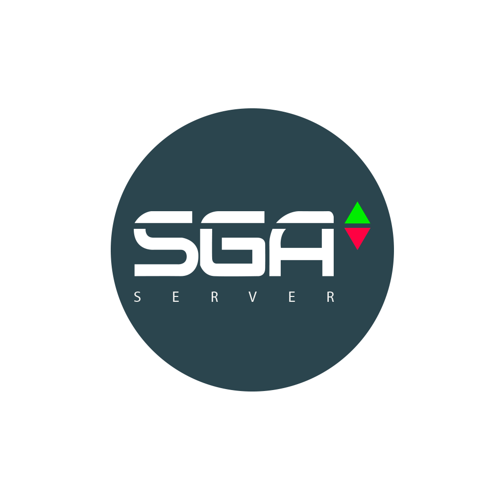

<h1 align="center">
 
  
 
 
SGA Print Server
</h1>

A simple Nodejs application for local printing.

                                     

## Drivers USB
- For windows [Zadig](https://zadig.akeo.ie/)
- For linux [Cups](https://localhost:631/)
- Run with admin run `sudo su` in terminal

## Install Dependencies

**GIT** 
`sudo apt install git` 

**NODE/NPM** 
1. Run `sudo apt install curl` 
2. Run `curl -sL https://deb.nodesource.com/setup_10.x | sudo -E bash -` 
3. Run `sudo apt install nodejs`. 

**NVM** 
1. Run `curl -sL https://raw.githubusercontent.com/creationix/nvm/v0.33.11/install.sh -o install_nvm.sh` 
2. Run `bash install_nvm.sh` 
3. Run `source ~/.profile` 
4. Run `nvm install 8.13.0` 
5. Run `nvm alias default 8.13.0` 

**Visual Code (optional)** 
`sudo snap install --classic code` 

## Getting started

PS: It's very important run with admin! Run `sudo su` in terminal

1. Clone this repository 
`sudo apt-get install build-essential libudev-dev`
`git clone https://github.com/sfilhu/SGAPrintServerBeckend.git` 
2. `cd SGAPrintServerBeckend` 

3. Run `sudo npm i` to install project dependencies 
4. Run `sudo npm rebuild` 
4. Run `sudo npm run start` 